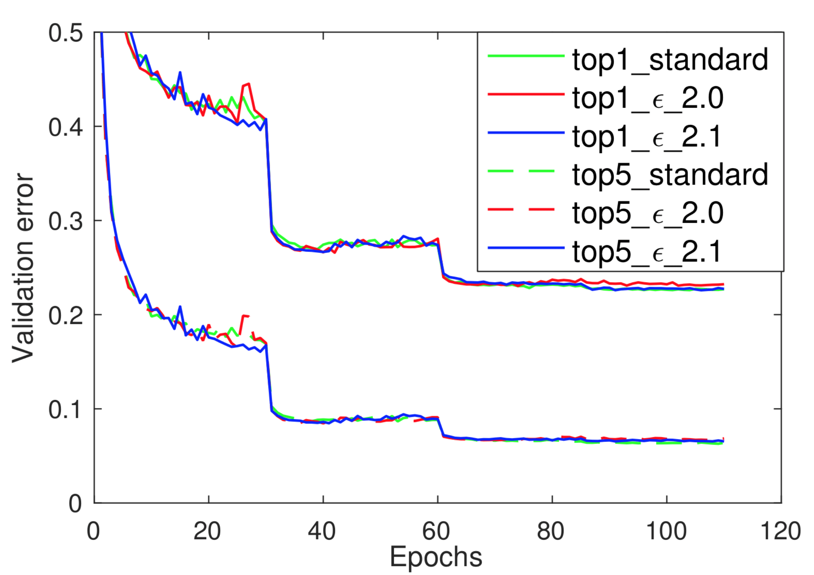
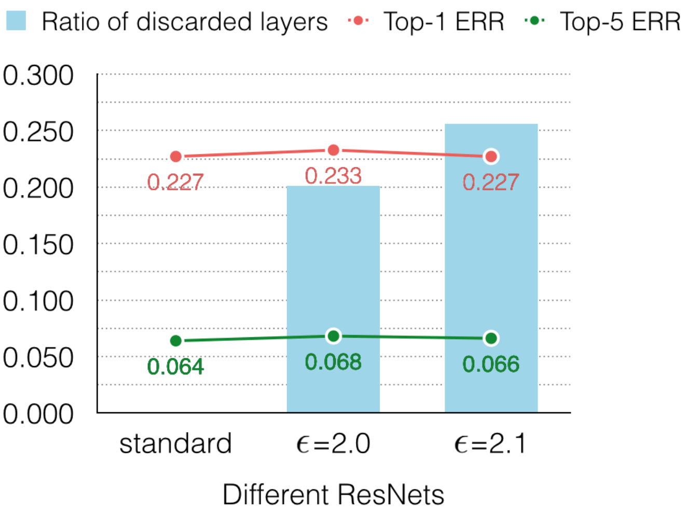
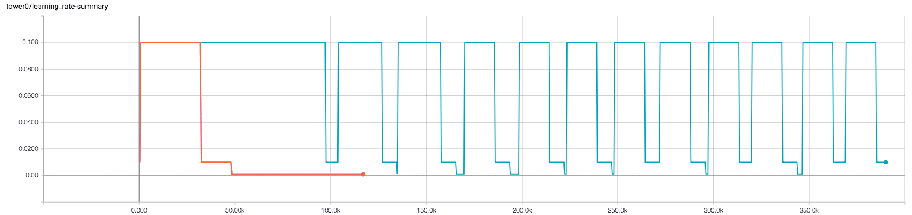

# epsilon-ResNet
[epsilon-ResNet](https://arxiv.org/abs/1804.01661) is a variant of ResNet to automatically discard redundant layers, which produces responses that are smaller than a threshold epsilon, with a marginal or no loss in performance.

Its implementation is built on [ResNet](https://github.com/ppwwyyxx/tensorpack/tree/master/examples/ResNet) of [tensorpack](https://github.com/ppwwyyxx/tensorpack). The idea is simple. We only add a few functions and make necessary changes on the original [ResNet](https://github.com/ppwwyyxx/tensorpack/tree/master/examples/ResNet). Hightlights include:

- EpsilonResNetBase.py

	Implementation of sparsity promting function with 4 ReLUs and side supervision at the intermediate of the network.
 
- LearningRateSetter.py

	A callback class for the impletmentation of adaptive learning rate. When the number of discarded layers increases, the adaptive learning rate is actived.
	
- imagenet-epsilon-resnet.py and cifar10-epsilon-resnet.py

	Training on ImageNet and Cifar10 datasets. We make no change on data augmentation. Modifications include: 
	
	+ In \_build\_graph(), strict\_identity() function is applied in residual functions. 
	+ In get_config(), a InferenceRunner() instance is added for side supervision; a LearningRateSetter() instance is added for adaptive learning rate.
	+ The variable discarded_cnt is to count the number of discarded layers.
	

## imagenet-epsilon-resnet.py
This is the training code of [epsilon-ResNet](https://arxiv.org/abs/1804.01661) on ImageNet. The experiment results on Pre-activatation ResNet(the standard one) and epsilon-ResNet of 101 layers are as below. Two epsilon values 2.0 and 2.1 give out 20.12% and 25.60% compression ratio seperately.



[comment]: <> (The two epsilon values give out the compression error:)

[//]: # ()

Usage:

```
python imagenet-epsilon-resnet.py -d 101 -e 2.0 --gpu 4 --data {path_to_ilsvrc12_data}  -o imagenet-e_2.0-d_101
```


## cifar10-epsilon-resnet.py
It is to train our model on cifar10. The experiment results on Pre-activation ResNet(the orange line), Pre-activation ResNet(the purple line), and epsilon-ResNet(the blue line) are shown as below:


The following figure shows the adaptive learning rate of this experiment. The two baselines adopt the same learning rate policy. 


Usage:

```
python cifar10-epsilon-resnet.py -n 18 -e 2.5 --gpu 1 -o cifar10-e_2.5-n_18 
```
## Install

Dependencies is the same as [tensorpack](https://github.com/ppwwyyxx/tensorpack):

+ Python 2.7 or 3
+ Python bindings for OpenCV (Optional, but required by a lot of features)
+ TensorFlow >= 1.3.0

```
# install git, then:
# pull tensorpack
git clone https://github.com/ppwwyyxx/tensorpack.git

# pull epsilon-ResNet
git clone https://github.com/yuxwind/epsilon-resnet.git

# put LearningRateSetter.py to {tensorpack_root}/tensorpack/callbacks/
# put others to {tensorpack_root}/examples/ResNet
```

## Citing epsilon-ResNet

Please cite epsilon-ResNet in your publication if it helps your research:

```
@article{DBLP:journals/corr/abs-1804-01661,
  author    = {Xin Yu and Zhiding Yu and Srikumar Ramalingam},
  title     = {Learning Strict Identity Mappings in Deep Residual Networks},
  journal   = {CoRR},
  volume    = {abs/1804.01661},
  year      = {2018}
}
```
